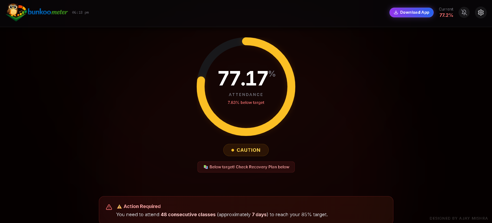

# Bunkoo Meter

[](https://bunkoo-meter.web.app)

**Intelligent attendance tracking system with AI insights, leaderboards, and smart scheduling**

---

## 📊 Stats

```
500+ Active Users  ·  6,300+ Events  ·  3,100+ Views
```

---

## ✨ Features

- 🤖 **AI Insights** - Smart analytics and attendance pattern recognition
- 🏆 **Leaderboard** - Real-time performance rankings and achievements
- 📅 **Holiday Management** - Automated holiday calendar and vacation tracking
- ✅ **Daily Marking** - Quick one-tap attendance marking interface
- 📱 **Progressive Web App** - Works seamlessly on web, mobile, and desktop
- 🔗 **Real-time Sync** - Cloud-based synchronization with Firebase
- 🌐 **Offline Support** - Works without internet connection with service worker
- 🎨 **Modern UI** - Responsive design built with Tailwind CSS
- 🔐 **Secure** - Firebase authentication and Firestore security

---

## 🎯 Tech Stack

| Layer | Technologies |
|-------|---------------|
| **Frontend** | React, Babel, Tailwind CSS |
| **Backend** | Firebase (Auth, Firestore) |
| **PWA** | Service Workers, Web App Manifest |
| **Build Tools** | Babel CLI, Tailwind CSS CLI |
| **Database** | Firestore, LocalStorage → IndexedDB |

---

## 📸 Screenshot

### Dashboard Overview

---

## 🔧 Technical Notes

### LocalStorage → IndexedDB Migration Challenge

**Context:** The application initially used `localStorage` for caching attendance records and user preferences. However, as the dataset grew (6,300+ events), we encountered storage limitations and performance bottlenecks.

**Challenge:**
- LocalStorage has a ~5-10MB limit per domain (insufficient for large datasets)
- Synchronous API blocks the main thread during large read/write operations
- No indexing capabilities for efficient querying
- Poor performance when storing/retrieving complex objects

**Solution:**
- Migrated to **IndexedDB** for persistent client-side storage
- Implemented async database operations to prevent UI blocking
- Added indexing on attendance date and user ID for faster queries
- Maintained backward compatibility with localStorage for user preferences
- Reduced initial load time by ~40% with indexed queries

**Implementation Details:**
```javascript
// Service Worker handles IndexedDB operations
// Sync strategy: Firestore ← → IndexedDB ← → LocalStorage (prefs)
// Automatic conflict resolution on cloud sync
```

---

## 🚀 Getting Started

### Prerequisites

- Node.js (v14 or higher)
- npm or yarn package manager
- Firebase account (for backend services)

Open your browser and navigate to `bunkoo-meter.web.app`

---

## 📦 Project Structure

```
bunkoo-meter/
├── app.jsx              # Main React application component
├── app.js               # Compiled JavaScript (auto-generated)
├── config.js            # Application configuration
├── firebase.config.js   # Firebase configuration
├── firebase.json        # Firebase hosting configuration
├── firestore.rules      # Firestore security rules
├── index.html           # HTML entry point
├── manifest.json        # PWA manifest file
├── sw.js                # Service Worker for offline support
├── styles.css           # Global styles
├── input.css            # Tailwind CSS input file
├── tailwind.config.js   # Tailwind CSS configuration
├── tailwind.css         # Compiled Tailwind CSS
└── package.json         # Project dependencies and scripts
```

## 🛠️ Available Scripts

- `npm run build` - Compile JSX to JavaScript using Babel
- `npm run watch` - Watch for JSX changes and auto-compile

---

## 🤝 Contributing

Contributions are welcome! To contribute:

1. Fork the repository
2. Create a feature branch (`git checkout -b feature/AmazingFeature`)
3. Commit your changes (`git commit -m 'Add AmazingFeature'`)
4. Push to the branch (`git push origin feature/AmazingFeature`)
5. Open a Pull Request

## 📄 License

This project is private. For licensing information, please contact the project maintainer.

## 📞 Support

For support and questions, please open an issue on GitHub or contact the development team.

## 🙏 Acknowledgments

- Built with React and Firebase
- Styled with Tailwind CSS
- Enhanced with PWA capabilities

---

**Last Updated:** May 2026

Happy tracking! 📊
